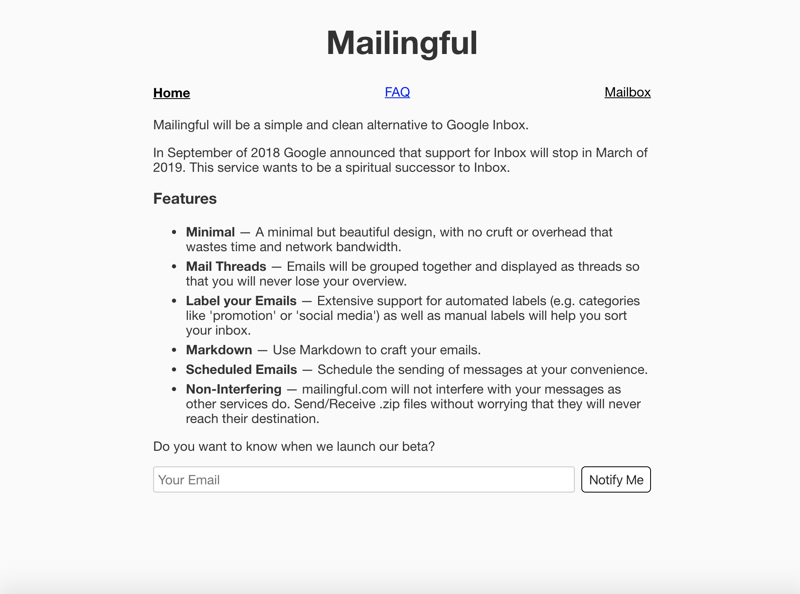
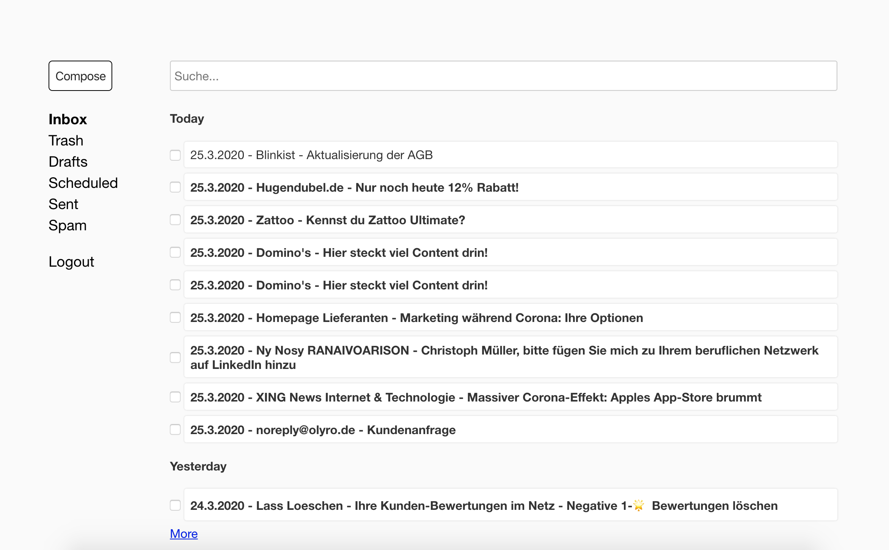
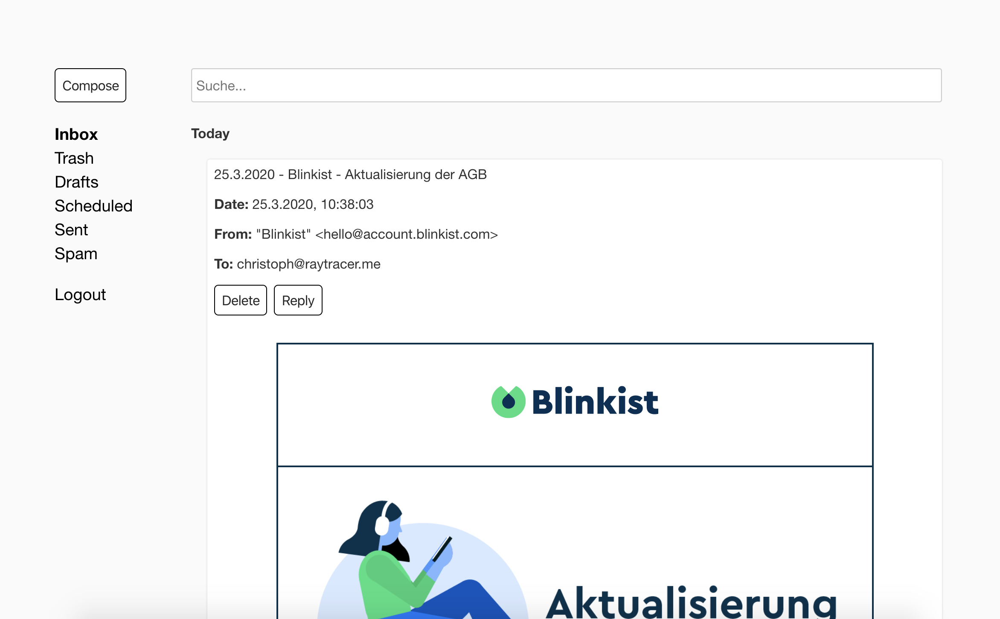
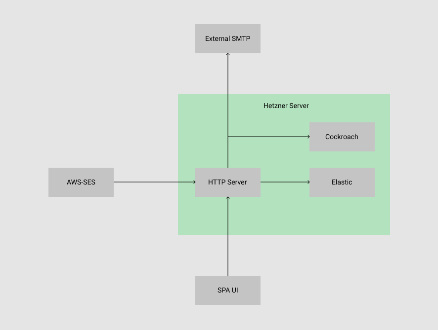

# Mailingful

This is the source code for the [mailingful](https://mailingful.com) platform. It was planned to be a small (commercial) e-mail service backed by AWS-SES. But its main purpose was to replace gmail for the author. Since there were some recent developments in gmail (the "send later" feature was finally added) and one of the original gmail developers created an [extension](https://simpl.fyi/) to simplify the UI, a few major selling points of mailingful are not that unique anymore and development has currently halted. Nevertheless I wanted to share the source code of the platform with the community.

Beware that the code is **not** production ready. While user authentication already works, the AWS lambda -> server direction (for inserting new emails) is currently not authenticated.

## Screenshots

## Archtiecture

